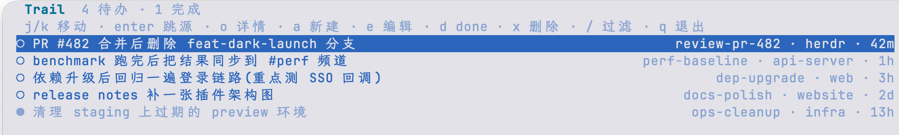
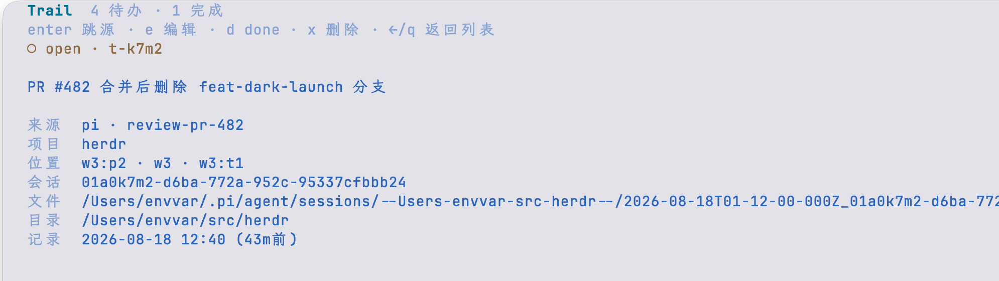

# herdr-trail

**One shared memo list for your whole herd.** Agents drop follow-ups, blockers, and cleanup notes the moment they notice them. You get a single live list — every entry remembers exactly which conversation it came from, and jumps back with one keystroke.

<p>
  
</p>

## Why

You run five pi sessions in parallel. One notices a flaky test it can't fix mid-task. Another finishes a migration that needs a follow-up check tomorrow. Today those thoughts die in scrollback. With herdr-trail the agent just calls `trail_add` and moves on — the entry lands in a herd-wide memo list with full provenance (agent, pane, project, cwd, pi session).

Open the list, hit `enter` on an entry, and you're **back in the exact conversation that wrote it** — focused live if the pane is alive, resumed via `pi --session` in a new tab if it's long gone. Hit `!` and the source agent is also handed the memo as a task, so it knows why you woke it.

This is **not** the conversation-local todo tool. Trail is a memo for *you*; the session todo is the agent's own scratch work queue.

<p>
  
</p>

## Install

```sh
herdr plugin install catoncat/herdr-trail
```

That's it. The pi skill `herd-trail` ships with the plugin and is picked up automatically (`~/.pi/agent/skills` symlink on install), so your agents immediately know when and how to record memos.

## Using it

**From any pi session** — the agent records things itself when something is worth your later attention:

```
trail_add   "staging 的 preview 环境超期了,下周清理"
```

**From anywhere in herdr** — open the floating list via the plugin action `Open trail list` (or bind a key):

| Key | Action |
|---|---|
| `j/k` `↑/↓` | move |
| `o` / `→` / `space` | detail page (full text + provenance) |
| `enter` | jump back to the source conversation (silent) |
| `!` | jump **and** deliver the memo as a task to that session |
| `tab` `1` `2` | open / done tabs |
| `g` | by project (default) ↔ by time |
| `a` / `e` | add / edit inline (arrows, Home/End, ctrl+a/e/u/k/w, CJK) |
| `d` / `x` | toggle done / delete (with confirm) |
| `/` | find · `c` / `esc` clear |
| `q` | close |

Default view is **open**, grouped by project (current project first). Tabs live in the header; actions stay in the footer. The overlay polls the store every 2s, so memos written by other agents appear live.

**From a shell** — a zero-dependency CLI is the single source of truth:

```sh
bin/herd-trail add "修 payment 重试的幂等键"   # auto-captures provenance in an agent pane
bin/herd-trail list --all                      # include done
bin/herd-trail edit t-k7m2 "新文本"
bin/herd-trail open t-k7m2 --deliver           # jump + hand the memo to that session
bin/herd-trail done t-k7m2 && bin/herd-trail undo t-k7m2
```

## Design

- **Zero dependencies**, plain Node ≥ 18. Store is one JSON file with mkdir-lock + atomic rename; 20-process concurrency tested.
- **Short ids** (`t-k7m2`), unique-prefix addressing everywhere.
- **Provenance is automatic**: agent name, pane/workspace/tab, cwd, pi session id + file — captured at `trail_add` time, no flags needed. Project name is the git root, not a noisy cwd basename.
- Single-responsibility on purpose: no due dates, no reminders. It's a trail of memos, not a calendar.

Data lives in `herdr plugin config-dir envvar.herd-trail` (fallback `~/.local/share/herd-trail`).

## Development

```sh
herdr plugin link .          # register locally
node --test                  # 71 tests
```

## License

MIT
